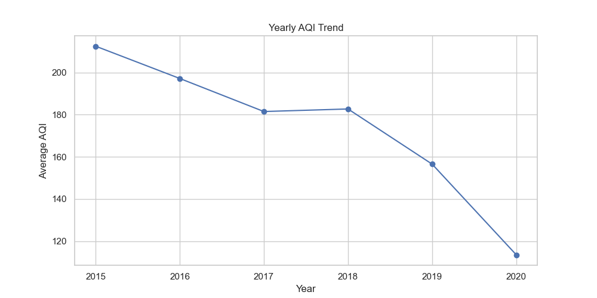
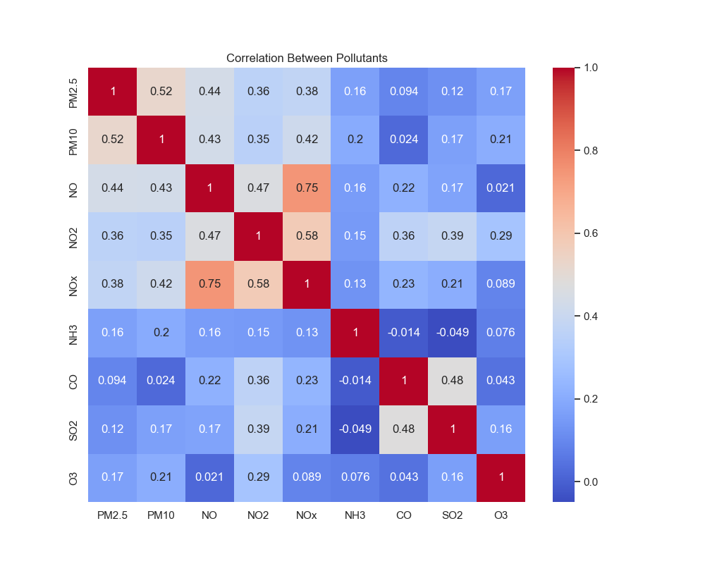
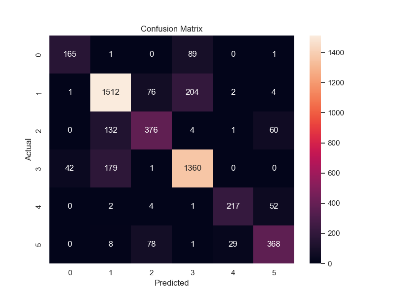

#  Air Quality Index Prediction using Machine Learning

##  Overview
This project focuses on analyzing air pollution data and predicting AQI using Machine Learning techniques.

##  Technologies Used
- Python
- Pandas, NumPy
- Matplotlib, Seaborn
- Scikit-learn

## Project Workflow
1. Data Cleaning & Preprocessing  
2. Exploratory Data Analysis (EDA)  
3. Feature Engineering (Year, Month, Season, Hour)  
4. Machine Learning Model (Random Forest)  
5. Data Visualization & Insights  

##  Key Visualizations
- City-wise PM2.5 comparison  
- Seasonal pollution variation  
- Yearly AQI trend  
- Hourly pollution pattern  
- Correlation heatmap  
- AQI category distribution  

## Model Used
- Random Forest Regressor

##  Results
- Accurate AQI prediction  
- PM2.5 is highly influential  
- Seasonal variation observed  

##  Files
- AQI_Prediction.ipynb  
- Dataset  
- Project Report  

##  Future Scope
- Real-time AQI prediction  
- Web app deployment  

##  Project Visualizations

### Yearly AQI Trend

### Correlation Between Pollutants

### Confusion Matrix

### Actual vs Predicted AQI (Line Graph)

